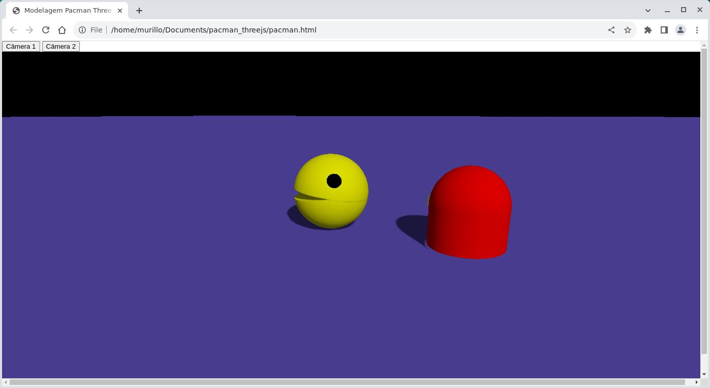
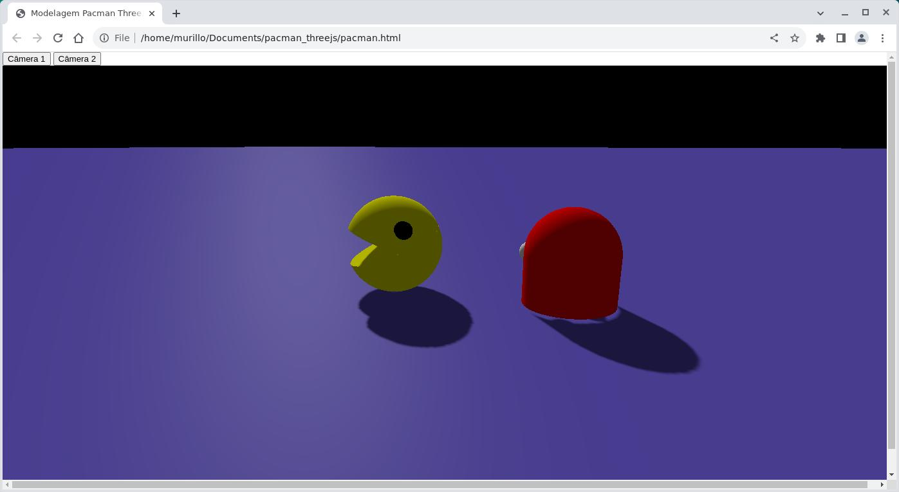

# pacman_threejs

## Conceito do projeto

Esse projeto consiste em uma cena baseada no jogo **Pacman** e seus
 **personagens**, implementada usando a biblioteca [**Three.js**](https://threejs.org/).

Na cena temos o _fantasminha_ perseguindo o _pacman_, enquanto esse anda
 em círculos para fugir do seu perseguidor.

## Execução

Para executar o projeto, antes é necessário fazer download do zip do
 repositório ou cloná-lo usando o comando:

```
git clone https://github.com/mutannejs/pacman_threejs.git
```

Dentro da pasta, basta abrir o documento `pacman.html` no navegador de
 sua preferência.

Na parte superior da tela, temos a opção de alternar entre duas câmeras,
 cada uma com uma visualização diferente da mesma cena. Para alternar
 entre elas, basta clicar nos botões **Câmera 1** ou **Câmera 2**.

### Câmera 1

Na **câmera 1** podemos ver a cena ...



### Câmera 2

Na **câmera 2** podemos ver a cena ...



## Implementação

### Pacman e Fantasma

Primeiramente, modelamos nossos dois personagens principais, o _Pacman_
 e o _Fantasma_, ambos são na verdade do tipo `THREE.Group()`, que nada
 mais é que um grupo de objetos. Cada um desses objetos foi implementado
 em uma função própria, possibilitando a reutilização do código quando
 possível.

O **pacman** é formado por 6 objetos:

- seus olhos são duas esferas, modeladas usando
 `THREE.SphereGeometry()`;
- seu corpo é formado por duas meia-esferas, implementadas usando
 `THREE.SphereGeometry()` passando como parâmetro _phiLenght_ igual a
 _Math.PI_, metade do valor padrão (Math.PI*2). As duas partes foram
 rotacionadas de modo que se complementassem como uma esfera inteira,
 possibilitando a animação que simula o abrir e fechar da boca do
 personagem;
- o interior de sua boca são dois discos, modelados usando
 `CircleGeometry()`, foram rotacionadas de modo que ficassem exatamente
 em cima da abertura das partes do corpo, cobrindo assim a abertura
 obtida ao definir o valor de _phiLenght_ como _Math.PI_.

O **fantasma** é formado por 6 objetos:

- seus olhos também são do tipo `THREE.Group()`, e cada um deles é
 formado por duas esferas, uma de cor preta, e outra azul com diâmetro
 igual a metade da outra esfera, posicionada de modo que represente
 a íris do olho, ambas modeladas usando `THREE.SphereGeometry()`;
- sua cabeça é formada por uma meia-esfera, implementada usando
 `THREE.SphereGeometry()` passando como parâmetro _phiLenght_ igual a
 _Math.PI_, metade do valor padrão (Math.PI*2). Ela foi rotacionada de
 modo que sua abertura ficasse direcionada para baixo;
- a parte de baixo do seu corpo é formado por um cilindro, modelado
 usando `THREE.CylinderGeometry()` passando como argumento _openEnded_
 igual a _true_, fazendo assim com que as extremidades do cilindro
 sejam abertas. Ele foi posicionado de modo que sua parte superior
 encostasse na borda da cabeça do personagem.

Todos os objetos usados na criação dos personagens são do tipo
 `THREE.Mesh()`, o qual usa modelos geométricos e possui como
 material `THREE.MeshLambertMaterial()`, possibilitando a interação dos
 objetos com as luzes e sombras definidas na cena.

### Luzes

A cena possui dois tipos de luzes.

Uma do tipo **direcional**, implementada usando
 `THREE.DirectionalLight()`, necessária para gerar sombras onde a luz
 não bate diretamente e deixar mais claro onde isso ocorre, a fim de
 trazer maior realismo.
 
A outra é a **luz ambiente**, implementada usando
 `THREE.AmbientLight()`, necessária para fornecer uma luz mínima à cena,
 possibilitando visualizar todos os objetos, mesmo que nenhuma luz
 direcional atinja os objetos em questão.

Para ser possível visualizar as sombras geradas a partir da utilização
 da luz direcional, foi necessário reposicioná-la em um local afastado
 da câmera, pois se ambos os elementos estivessem na mesma direção em
 relação à cena, as sombras se projetariam atrás dos objetos, onde a
 câmera não pudesse capturá-las.

### Câmeras

Como mencionado na descrição de como executar o projeto, a cena possui
 duas câmeras que podem ser escolhidas para gerar imagens diferentes
 da cena. Ambas após serem cridas, foram inseridas em um elemento do
 tipo `THREE.ArrayCamera`, possibilitando e facilitando a escolha de
 apenas uma câmera para gerar imagem durante a renderização da cena.

A **primeira câmera** foi implementada usando
 `THREE.PerspectiveCamera()`, e mostra a cena do modo como os seres
 humanos enxergam, ou seja, com perspectiva. Essa escolha faz com que
 ao andar da animação, os objetos em cena fiquem maior ou menores
 dependendo da distância que estão da câmera, podendo até mesmo ficarem
 distorcidos.

A **segunda câmera**.

Ao reposicionar ambas as câmeras na cena, foi necessário usar o método
 `lookAt(scene.position)` para cada uma delas, para redirecioná-las ao
 centro da cena, centralizando a imagem em relação ao local onde os
 personagens se encontram, sem que sumam da tela durante a animação.

### Animação

Para criar a animação da cena e dos personagens, primeiramente foi
 criado outro elemento do tipo `THREE.Group()` chamado de _system_, ao
 qual foi adicionado o pacman e o fantasma. Os personagens foram
 reposicionados e rotacionados para que ficassem um pouco distantes do
 centro do _system_ e para que o fantasma ficasse atrás do pacman.

O movimento de **"andar"** dos personagens, foi implementado como o
 rotacionamento de _system_ em torno do _eixo Y_, assim, o pacman e o
 fantasma parecem rodar em círculos, enquanto um persegue o outro sem
 nunca alcançá-lo.

O movimento de **"comer"** do pacman, foi implementado como o
 rotacionamento das duas partes do corpo do pacman (considerando uma
 parte a junção de uma meia-esfera e de um disco) em torno do _eixo Y_,
 porém, como os objetos que compõem o personagem foram rotacionados
 exatamente _Math.PI*0.5_ em torno do _eixo X_, esse rotacionamento
 parece estar sendo feito em torno do _eixo Z_ ou do _eixo X_ dependendo
 do momento. Lembrando que os eixos X e Y do pacman estão sempre
 mundando de posição durante a animação.

### Plano

Por fim, foi criado um plano posicionado em baixo dos personagens, o
 qual escolhemos para utilizar o nosso shader próprio.

## Membros

Paula Caires Silva - [https://github.com/paulacaires](https://github.com/paulacaires)

Murillo Justino dos Santos - [https://github.com/mutannejs](https://github.com/mutannejs)
